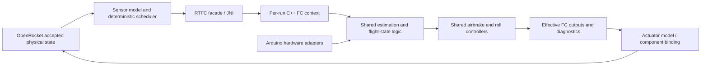

# Plan: integrate Zephyrus C++ into OpenRocket

Proposed implementation plan, 20 September 2026. Based on the [framework and source review](/Users/mdn/Developer/ActiveControl_MIT_RktTeam/doc/FCsim/flight-computer-simulation-framework.md). No integration changes have been made yet.

## 1. Outcome and architectural decision

Make a packaged OpenRocket simulation run the current Zephyrus FC's flight-state logic, sensor processing and airbrake controller, with simulated hardware inputs and observable outputs. Keep the main artifact as the root `shadowJar`. Make the current Java listener the integration boundary and turn `RTFC` into a small facade over a reusable C++ core.

**Recommended approach: compile shared, portable C++ logic and invoke it through JNI.** JNI is the Java 17 interface for calling existing C/C++ libraries from the JVM. This recommendation follows from the source review: the actual airbrake class already compiles on the host with a very small clock adapter, whereas the existing Java translation has diverged. [Java 17 JNI specification](https://docs.oracle.com/en/java/javase/17/docs/specs/jni/intro.html).

| Option | Assessment for this project |
|---|---|
| Continue translating everything to Java | Easiest platform-independent JAR, but requires maintaining a second implementation of states, estimators and control laws. Existing divergence demonstrates the maintenance cost. Keep only as an explicitly chosen alternative if native artifacts are unacceptable. |
| Shared C++ core + JNI | Recommended. Reuses control/state-estimation behavior, fits Java 17, and allows fast in-process stepping. Adds per-platform binaries and native lifecycle/error handling. Native memory errors can terminate the JVM, so exercise the standalone core before loading it. |
| Separate host process | Useful later for crash isolation or hardware-in-the-loop transport. Initially adds protocol, process management and distribution work without resolving sensor/timing semantics. |
| Emulate the entire STM32/Arduino environment | Excess scope for the first integration. Most required behavior can be separated from register-level I/O. |

This is software-in-the-loop, not execution of the flashed microcontroller binary. Preserve single-precision firmware arithmetic and exact decision boundaries where practical, but validate numerical tolerances across host and embedded builds rather than claiming bit-for-bit CPU equivalence.

## 2. Scope and source ownership

Use **`FC/FC.ino` plus `RT_Firmware_Libs/airbrakes.cpp`** as the baseline. Treat the standalone airbrake sketch and both Java airbrake controllers as comparison material, not interchangeable implementations. Preserve their identities in run metadata. [FC][FW-FC], [library][FW-AB], [Java predecessor][OR-Java-AB].

| Component | Planned treatment |
|---|---|
| FC setup/loop ordering, flight state, command handling and enable gates | Extract into a shared C++ runtime called by both Arduino and host wrappers. Preserve transition side effects and strict timer comparisons. |
| Airbrake state, preparation, fits, requested area, feedback and deployment | Compile the shared C++ implementation. Add diagnostics and explicit context state; do not rewrite the control law in Java. |
| Accelerometer, barometer, gyro, GPS processing | Preserve calibration/conversion, validity, zeroing, filtering and integration logic in shared C++; replace hardware acquisition at a declared boundary. |
| Pyro decisions and continuity state | Keep six-channel logical behavior and timestamps; model outputs in memory. Map recovery effects to OpenRocket in a separately configured stage of the plan. |
| Roll control | Compile the existing small C++ controller as part of FC completeness. Start airbrake validation with a declared zero-actuation roll test configuration; add physical tab output after axis/sign validation. |
| Radio, flash, power, cameras and video | Deterministic in-memory adapters that record calls, serve declared input/status values and preserve relevant command/packet behavior. No RF propagation, electrical power model or video simulation initially. |
| Separate ground-station, power-board, beacon and accessory sketches | Outside the first milestone. |

Move portable computation into the shared firmware library so the Arduino sketch becomes a hardware wrapper around the same core used by OpenRocket. Avoid copying business logic into a simulation-only fork. During development, allow an explicit path to the local library checkout; for reproducible builds, import a pinned source snapshot with revision, hashes, license and patch manifest. Use one version of that shared core in both host and Arduino builds. Do not make the released JAR depend on these absolute local folders.

## 3. Target structure and boundary contracts

Suggested layout, to be created during implementation:

- In the shared firmware library: portable FC runtime/state types and sensor-processing units; Arduino acquisition/output adapters remain alongside them.
- In OpenRocket: `core/src/main/native/zephyrus/` for host adapters, a C interface, JNI glue, native tests and CMake configuration.
- In `edu.mit.rocket_team.zephyrus`: instance-based `RTFC`, a `FlightComputerBackend` interface, `NativeFlightComputerBackend`, immutable sensor/output records, clock/scheduler, diagnostics and component adapters.
- Generated native libraries under the build directory, copied into `core` resources for the root JAR; nothing generated into handwritten source folders.

### Native API

Use an opaque context per simulated FC. A small C interface can expose `create(config)`, `step(handle, input, output)`, `reset(handle, bootConfig)`, `destroy(handle)` and version/diagnostic queries. JNI wraps that interface. C++ objects, packed firmware structs and OpenRocket Java objects do not cross it directly.

| Payload | Required content |
|---|---|
| Configuration | Schema/version, firmware revision/patch set, nominal loop and sensor periods, sensor mounting rotation, calibration/noise seed, boot/preflight scenario and enabled actuator models. |
| Input frame | Monotonic host simulation timestamp in integer microseconds; per-sensor acquisition timestamps/new-data/validity flags; sensor values at the selected acquisition boundary; queued ground commands; virtual peripheral status. |
| Output frame | FC state and transition time; enable flags; raw controller deployment and effective gated airbrake command; roll demand and effective servo output; six-channel pyro events/status; peripheral/logging events. |
| Diagnostics | Airbrake state, valid sample count, fitted/retained coefficients, predicted and target altitude, requested area, saturation, integral state and numerical faults. |

Use explicit-width integers and field-by-field serialization. A boolean crossing the ABI is a defined byte/integer, not a copied C++ `bool` layout. Keep FC flight-start timing in C++, so Java does not accidentally impose OpenRocket liftoff/apogee decisions. Batch one call per FC tick. Catch C++ exceptions at the boundary; return an error that Java translates into a simulation failure containing time, context and firmware version.

### Sensors and units

Use a **sensor acquisition boundary**, not a shortcut that supplies filtered altitude and perfect velocity to the full FC. Initial integration can inject calibrated specific force and angular rates, pressure/temperature before barometric altitude filtering, and decoded GPS observations before offset/max-altitude logic. This preserves the flight-critical estimators; raw SPI register, ADC compensation and UBX-byte parsing fidelity remain separately testable adapter layers. An airbrake-only replay may use `AirbrakesData` directly, but must identify itself as such.

| Item | Contract and verification |
|---|---|
| Accelerometer | Three sensor-axis specific-force components in m/s². Starting convention: `f_sensor = R_sensor_from_world × (a_world − g_world)`, with gravity/frame/pseudo-acceleration conventions explicitly reconciled to OpenRocket's derivative. Test stationary pad, free fall, vertical thrust and tilted motion. |
| Mounting | OpenRocket simulation body Z is longitudinal; firmware velocity/roll calculations use sensor X. Represent the mounting rotation explicitly. Preserve the separate `getAccelZ()` airbrake input until its intended meaning is resolved. Do not infer a complete mounting rotation from one axis observation. |
| Barometer | Pa/K in the physics adapter; convert explicitly to hPa/°C if entering at firmware engineering-unit methods. Preserve altitude formula, 20-sample filter, zero offset and maximum logic. Raw-ADC mode, if added, uses counts and the source calibration constants. |
| GPS | Latitude/longitude with explicit units, absolute height in a documented datum, fix type and age. Preserve the firmware's offset to relative height. The current UBX code uses `height`, not `hMSL`; any ellipsoid/geoid simplification must be stated. |
| Gyro | Body-to-sensor angular-rate rotation, then conversion from rad/s to degrees/s and the source sign/bias conventions. Preserve source integration; do not derive roll from the rocket-axis azimuth. |
| Truth separation | World velocity, geometric apogee and model altitude are diagnostic channels. The complete FC receives its measured/estimated equivalents. |

The first no-noise case must be deterministic. Add seeded noise, bias, saturation, quantization, latency and dropout as configurable sensor effects after it passes. Physical truth, acquired readings and FC estimates must remain separately logged.

## 4. Deterministic time and OpenRocket coupling

Use a 64-bit simulation clock in microseconds. Arduino-facing `millis()`/`micros()` expose the source's unsigned 32-bit wrap behavior. Flight time is measured from the FC's own transition to `FLIGHT`, and is independent of prelaunch boot time and OpenRocket's launch epoch.

The host wrapper must not execute the sketch's busy-wait against a frozen clock. Extract one non-blocking FC iteration; let the scheduler replace the final 10 ms wait. Hardware initialization/conversion delays become modeled readiness/completion times or an explicitly declared nominal abstraction. Never substitute wall-clock sleeps. Start with a nominal 10 ms FC cadence and a 20 ms PWM latch; do not claim cycle-accurate STM32 execution. Preserve `>50`, `>100` and other source comparisons rather than silently changing their effective periods.

Provide two explicit behavioral baselines:

- **Source-compatibility baseline:** preserve observable source behavior, including integer-divided airbrake time, for comparison with the extracted core.
- **Corrected candidate:** separately version fixes such as fractional airbrake time, complete reset and selected numerical guards. Every difference has a focused test and appears in run metadata. Undefined memory behavior is not a valid compatibility target; reproduce intended static startup state explicitly.

### Scheduling in this fork

The active engine is [ModifiedEventSimulationEngine][OR-engine], usually with [RK6][OR-RK6]. Both RK6 and RK4 override the computed timestep with a global value. Fix or bypass that override **in FC mode**, through per-run scheduling, before claiming accurate firmware timing. Keep ordinary non-FC simulations covered by regression checks.

1. Maintain independent next-due times for physics, sensor acquisition/delivery, FC iterations, PWM latching and queued events.
2. Bound physics steps by the next due event/tick and normal numerical limits. Begin with a maximum 2.5 ms physics step and 10 ms FC period. Handle off-grid engine events and minimum-step clamps explicitly; a step must not skip a controller tick and then replay several ticks with one future sample.
3. Build sensor observations from coherent physical states. For the first implementation, capture the first derivative stage at an accepted interval start, with its timestamp and attitude, and queue that reading for delivery after the interval. This is a declared acquisition latency of up to one physics step, not an endpoint acceleration estimate. Intermediate RK trial callbacks must not advance FC state, generate new noise draws or consume input packets.
4. At a boundary, deliver due sensor samples, run a due FC iteration once, apply due PWM latching in a fixed documented order, then hold actuator state through the next physics interval. Bootstrap time zero with a coherent stationary-pad sample. If zero-latency endpoint sampling is added later, provide an explicit accepted-state derivative hook rather than using the last arbitrary RK trial or a mismatched flight-log row.
5. Guard repeated `postStep` calls at an unchanged time and terminal `step(..., NaN)` data-recording calls. The native loop must execute exactly once per scheduled FC tick.
6. Apply the same scheduler constraints when the engine switches to landing or ground steppers; otherwise the main-deployment and pyro timers lose their timing guarantees.

Model startup with a stationary prelaunch warmup, followed by a simulated preflight command, then release the physical rocket at OpenRocket time zero. Advance firmware boot time during warmup while holding the physical pad state fixed. This allows filters and zero offsets to initialize. Do not auto-set `FLIGHT` or `APOGEE` from simulator truth. Mid-flight starts require an explicit firmware checkpoint or a documented initialization scenario; copying a few `SimulationStatus` flags is insufficient.

### Lifecycle and component ownership

Replace static FC state and component pointers with one run-owned context. Resolve airbrakes and optional roll tabs by configured component identity in the simulated rocket copy. Missing/ambiguous required components should produce an actionable configuration error; an airbrake-only case must not require roll-tab hardware.

`SimulationStatus.clone()` is shallow, while its copy constructor clones `SimulationConditions`, which clones listeners. These copies occur during stepper initialization and recovery transitions, not just at stage separation. Preserve a shared run session through same-flight framework copies, with exactly one owner for native destruction; do not shallow-copy an independently owning native pointer or restart the FC on each copy. Rebind components when a copied configuration requires it. [Status cloning][OR-status-clone], [listener cloning][OR-conditions-clone].

Initially support one FC-bearing flight branch and reject unsupported multi-FC/staging configurations explicitly. Later define which branch retains the physical computer and how independent computers/checkpoints are copied. The engine also runs an auxiliary coast calculation using cloned listeners: filter out the live FC there or give that calculation its own isolated simulation context. It must not reset or advance the primary FC. [Auxiliary simulation][OR-coast].

Close native state on normal completion, cancellation, setup failure and both checked/unchecked exceptions. Add a run-level `finally` owner; current end-listener callbacks alone do not cover all paths.

## 5. Actuation, recovery and observability

The effective airbrake command must include the sketch's enable flags, manual angle path and apogee closure. Keep commanded deployment, latched PWM/angle and realized exposed fraction separate. First verify an ideal actuator; then add source PWM cadence, range, travel speed and delay. Calibrate the servo-linkage-to-area map separately. Check monotonic drag increase with exposed area using OpenRocket's component model; do not accidentally apply existing fudge multipliers twice. [Firmware outputs][FW-output], [component][OR-AB-component], [drag][OR-AB-aero].

Run the airbrake experiment with a single controller owning its component. Legacy `AirbrakesControllerListener` must not also actuate it. Record all six pyro-channel events from the beginning. For full descent simulation, define a component/channel recovery map and suppress duplicate automatic recovery commands for the mapped devices. Until that stage is implemented, label pyro behavior as recorded-only and use an explicit baseline recovery configuration; it is not FC-controlled recovery.

Per-run logs should contain physical state, delivered sensor samples and ages, FC estimates/state transitions, controller internal state, requested/effective/realized outputs, native errors, firmware revisions/patches, units, sensor seed and scheduler settings. Store bounded or streamed structured records rather than unbounded static lists and per-physics-step console output.

## 6. Implementation sequence and acceptance gates

| Stage | Work and concrete deliverable | Gate before proceeding |
|---|---|---|
| 0. Freeze and characterize | Pin the three reviewed source revisions; record the selected firmware library path, board configuration and relevant hashes. Create replay fixtures and a baseline issue ledger using the framework's J/F identifiers. Preserve the successful root packaging baseline. | Can identify exactly which C++ code and parameters a run uses; source-equivalence and proposed corrections are distinguished. |
| 1. Portable airbrake library | Formalize the small host clock adapter and standalone C++ runner. Define explicit startup/reset state, diagnostics and `AirbrakesData` replay. Preserve nominal source behavior before applying individual fixes. | Replay is repeatable; two contexts are independent; timeout/partial sample sets, zero velocity, numerical limits and reset are characterized. The integer-time discrepancy has a regression fixture. |
| 2. Small Java/native integration | Implement the backend interface, JNI lifecycle, packaged library loading and an airbrake-only listener scenario. Bypass obsolete Java controller execution; repair shared listener startup/component assumptions that remain in use. | From the actual shadow JAR, create/step/destroy native contexts and match standalone native replay for identical inputs. No old Java controller also writes the airbrakes. |
| 3. FC extraction and sensor processing | Share the portable FC state machine, loop ordering, enable gates and estimation with the Arduino wrapper. Add deterministic sensor/peripheral adapters, command injection and boot/preflight handling. | Full FC consumes samples rather than perfect velocity/apogee. State transitions, filter/zeroing behavior, outputs and peripheral scheduling match the source baseline fixtures. Arduino build confirms the extraction still compiles for its real board. |
| 4. Physical closed loop and timing | Add per-run scheduling through Modified engine and RK6/RK4; coherent sample delivery; component binding; ideal then finite-speed airbrake actuation. Validate roll mapping and add physical roll output. | One FC update per due tick regardless of physics step size; no event overshoot; braking changes the trajectory through drag; actuator gating matches FC state. |
| 5. Descent, robustness and packaging | Configure pyro-to-recovery mapping; test recovery stepper changes, cleanup and auxiliary coast runs. Add sensor faults, repeated/parallel runs and release-platform builds. | Full supported flight sequence is reproducible, mapped recovery is driven once, contexts remain isolated, and packaged execution works without a source checkout or native compiler. |

The first vertical slice is **the current C++ airbrake library stepping through `RTFC` in a packaged JAR and changing OpenRocket drag**, using explicit replay/ideal inputs. It is a milestone toward the full FC integration, not the final completion criterion.

### Tests that establish the important properties

| Test group | Evidence sought |
|---|---|
| Native replay/parity | Standalone host and JNI produce the same state transitions and deployment for identical sample/time sequences. Maintain source-compatibility traces and explicitly different corrected traces. Compare against an embedded build/replay before claiming flight-firmware equivalence. |
| Estimation and frames | Stationary pad produces the chosen gravity axis and near-zero integrated vertical speed after zeroing; free fall, tilt and known rotation check signs/units; barometer filter step response and GPS fix loss check validity/latency. |
| Airbrake edge cases | Prep timeout with fewer than 20 samples, zero/negative velocity, no required braking, infeasible demand, degenerate gains, saturation, apogee in each state and reset during/after a run. |
| FC states and outputs | Preflight command, launch threshold, strict 26/35 s apogee timing, 20 m descent, sensor disagreement, 3/5/55 s recovery timing, manual commands, channel bounds and controller-disable output closure. |
| Timing | Physics maxima of 1.25/2.5/5 ms with the same 10 ms FC schedule, off-grid events, repeated callbacks, fixed input latency and 32-bit clock wrap. Compare trajectory convergence rather than requiring identical physical integration results. |
| Lifecycle | Two sequential and two concurrent runs; fresh versus reset context; initial stepper copy, recovery transition, auxiliary coast simulation, cancellation and thrown native/Java errors. No shared state, double free or leaked active context. |
| Closed loop | Same rocket/motor/atmosphere/seed with zero braking, prescribed braking and FC braking. Verify component-area/drag response, finite trajectories and physically explainable apogee differences. Controller target accuracy is evaluated separately from successful code integration. |
| Distribution | Root `shadowJar` contains expected class/resources and loads the correct native architecture in both packaged startup and headless/JPype use; missing/unsupported native builds fail clearly. |

Select numerical tolerances from replay precision and timestep-convergence results and record them with the fixtures. Do not invent an apogee-accuracy guarantee before the model, rocket configuration and firmware calibration have been established.

## 7. Gradle and distribution work

Keep root `:shadowJar` as the packaging entry point. Add native configure/build and test tasks, with Java JNI header generation where used, then arrange generated native resources as an input to `:core:processResources`. Ensure the dependency graph is acyclic: generate JNI headers from Java compilation, build native code, copy resources, then build JARs. Verify the actual root task graph, including its existing subproject/distribution tasks. [Current build][OR-build].

Package native files by OS/architecture, for example `native/macos-aarch64/`, `native/macos-x86_64/`, `native/linux-x86_64/` and `native/windows-x86_64/`. Start with **macOS arm64**, the reviewed host. Add only tested targets to the supported release matrix; building on one Mac does not generate all platform binaries automatically. Account for dependent C++ runtime libraries and platform-specific compiler differences, including the firmware's packed types.

The loader selects a matching resource, extracts it to a versioned private local path and loads the absolute filename with `System.load`. A library stored inside a JAR is not directly a filesystem library path; extraction/loading is additional implementation work, not something Shadow provides automatically. Check schema/version compatibility before stepping. Missing binaries must not silently fall back to the divergent Java controller. [Java 17 System.load contract](https://docs.oracle.com/en/java/javase/17/docs/api/java.base/java/lang/System.html#load(java.lang.String)).

Keep native loading lazy so an ordinary OpenRocket simulation can still run without enabling Zephyrus. Validate both the current shaded launch and the development module path. A dedicated Zephyrus extension/provider can subsequently expose component selection, backend/configuration and sensor settings, following the existing extension pattern. The headless `Simulation.simulate(listener...)` route is sufficient for the first implementation slice. [Extension pattern][OR-extension-example].

## 8. Decisions to resolve during implementation

These questions do not block the completed source review or the portable-airbrake slice. They determine what a full FC flight result means:

- Confirm the firmware library checkout actually used for the target Arduino build and its STM32 board/core settings.
- Establish the sensor mounting rotation and whether airbrake acceleration is intended to be sensor Z, longitudinal X, or gravity-compensated vertical acceleration. Preserve and label the current source mapping until resolved.
- Choose the physical rocket/motor baseline, altitude datum, airbrake linkage calibration and whether the existing 5046 m prediction patch/5000 m target are intentional for that case.
- Record which firmware fixes are included in a corrected candidate, especially fractional time, forced-full-deployment behavior, partial-sample handling and reset. Porting alone must not hide these changes.
- Define the six pyro outputs' simulation recovery-component mapping and the supported deployment sequence.
- Expand the release-platform matrix only when corresponding build/test hosts are available.

The completed integration should run shared C++ FC logic from the distributable JAR, receive declared simulated measurements, actuate the physical model through effective FC outputs, produce repeatable diagnostics and survive reset/cleanup paths. Airbrake accuracy, sensor realism and agreement with flight data then have explicit, testable places in the framework.

[OR-build]: /Users/mdn/Developer/ActiveControl_MIT_RktTeam/clone/openrocket/build.gradle:118
[OR-engine]: /Users/mdn/Developer/ActiveControl_MIT_RktTeam/clone/openrocket/core/src/main/java/info/openrocket/core/simulation/ModifiedEventSimulationEngine.java:28
[OR-coast]: /Users/mdn/Developer/ActiveControl_MIT_RktTeam/clone/openrocket/core/src/main/java/info/openrocket/core/simulation/ModifiedEventSimulationEngine.java:772
[OR-RK6]: /Users/mdn/Developer/ActiveControl_MIT_RktTeam/clone/openrocket/core/src/main/java/info/openrocket/core/simulation/RK6SimulationStepper.java:90
[OR-Java-AB]: /Users/mdn/Developer/ActiveControl_MIT_RktTeam/clone/openrocket/core/src/main/java/edu/mit/rocket_team/zephyrus/control/airbrakes/RTAirbrakesController.java:20
[OR-AB-component]: /Users/mdn/Developer/ActiveControl_MIT_RktTeam/clone/openrocket/core/src/main/java/info/openrocket/core/rocketcomponent/AirbrakeSet.java:405
[OR-AB-aero]: /Users/mdn/Developer/ActiveControl_MIT_RktTeam/clone/openrocket/core/src/main/java/info/openrocket/core/aerodynamics/barrowman/AirbrakeSetCalc.java:33
[OR-status-clone]: /Users/mdn/Developer/ActiveControl_MIT_RktTeam/clone/openrocket/core/src/main/java/info/openrocket/core/simulation/SimulationStatus.java:571
[OR-conditions-clone]: /Users/mdn/Developer/ActiveControl_MIT_RktTeam/clone/openrocket/core/src/main/java/info/openrocket/core/simulation/SimulationConditions.java:260
[OR-extension-example]: /Users/mdn/Developer/ActiveControl_MIT_RktTeam/clone/openrocket/core/src/main/java/info/openrocket/core/simulation/extension/example/AirStart.java:17
[FW-FC]: /Users/mdn/Developer/MIT_Rkt_Team/Avionics2025/RT_Arduino/Zephyrus/FC/FC.ino:101
[FW-output]: /Users/mdn/Developer/MIT_Rkt_Team/Avionics2025/RT_Arduino/Zephyrus/FC/FC.ino:742
[FW-AB]: /Users/mdn/Developer/MIT_Rkt_Team/Avionics2025/RT_Firmware_Libs/airbrakes.cpp:180
