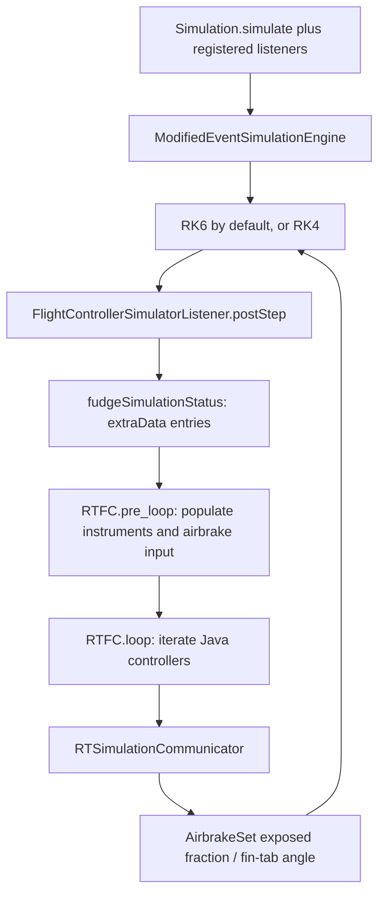

# Zephyrus flight computer simulation framework

Source review: 20 September 2026. This describes the checked-out code, not a completed firmware integration. The accompanying [C++ integration plan](/Users/mdn/Developer/ActiveControl_MIT_RktTeam/doc/FCsim/cpp-integration-plan.md) describes proposed changes.

The existing Java package provides the connection points for software-in-the-loop simulation, but it does not yet execute the Zephyrus flight computer. Its airbrake controller is a partial Java translation of an older standalone sketch. The actual FC now calls a different C++ airbrake library, located outside the supplied sketch directory. Reusing that library and the FC's state-estimation and flight-state logic is the most direct way to simulate the current firmware.

## 1. Sources and scope

| Source | Reviewed location and revision |
|---|---|
| OpenRocket fork | `/Users/mdn/Developer/ActiveControl_MIT_RktTeam/clone/openrocket/`, a symlink to `openrocket-release-24.12.RC.01`. Containing repository HEAD: `1d68549f7318bf619a28efc1024fe56318ae047c`; last commit affecting this source subtree: `e7dc90831742b3f12f4fcbcfcdc131368f9c8787`. |
| Arduino sketches | `/Users/mdn/Developer/MIT_Rkt_Team/Avionics2025/RT_Arduino/Zephyrus/`. Repository HEAD: `4cd2660eec92a47be42c09ed7b61f38295bcf970`. Primary entry point: [FC/FC.ino][FW-FC]. |
| Shared firmware libraries | `/Users/mdn/Developer/MIT_Rkt_Team/Avionics2025/RT_Firmware_Libs/`. Separate repository HEAD: `1db1f223c0c7d2287611c9f66d5de6c691455359`. Located by following the FC's includes; contains the flight-critical sensor, airbrake, roll, and pyro implementations. |

The working trees were clean when inspected. These revisions identify the local source baseline, not a verified flashed flight binary. The sketch's actual Arduino library search path and board build configuration were not established; the adjacent `RT_Firmware_Libs` checkout is the concrete dependency source for this plan.

The review covered all 33 Java files under `edu.mit.rocket_team.zephyrus`, the simulation listener and its engine/stepper/component connections, the FC and standalone airbrake sketches, and the relevant shared C++ libraries. Camera, radio, power and flash code were considered as FC dependencies, rather than targets for detailed hardware simulation. Existing prose notes were treated as background and checked against source; their instructions were not adopted as user requests.

## 2. Build and simulation entry points

The Gradle project has root, `core`, and `swing` projects. Root depends on `swing`, which depends on `core`; the Zephyrus classes belong to `core`. The configured Java target is 17, the wrapper is Gradle 8.12.1, and Shadow is 8.1.1. The requested main packaging task is root **`:shadowJar`**, invoked from the OpenRocket directory as `./gradlew shadowJar`. There are also subproject shadow tasks. Root produces `build/libs/OpenRocket-24.12.RC.01.jar` with the Swing startup class; it also depends on the distribution archive tasks. No C++ compilation or FC native-library packaging exists in the reviewed build. [Build configuration][OR-build], [modules][OR-modules].

The resource build requires the OpenRocket component database. It is present locally. Its validation task can arrange a Git submodule update when resources are missing, so a reproducible build should pin/provision that dependency rather than treating it as unrelated setup. [Resource tasks][OR-core-build].

A significant fork-specific detail: `Simulation.simulate(...)` explicitly constructs **`ModifiedEventSimulationEngine`**. That engine chooses RK6 or RK4 from `NewControlStepListener.useRK6`, whose default is **true**. It starts a branch with the flight stepper, then can switch to landing/ground steppers on events. Therefore the actual default path is not the upstream basic engine or necessarily RK4. [Simulation entry][OR-simulate], [engine][OR-engine], [default choice][OR-RK-choice].

Listeners can be supplied to `Simulation.simulate(listener...)`, or installed by an extension. The generic Java-code extension can instantiate a listener from its class name. Merely placing `FlightControllerSimulatorListener` in the JAR does not activate it. No dedicated Zephyrus extension/provider or Zephyrus-specific test was found. The nearby Python Zephyrus example currently selects the separate `AirbrakesControllerListener`, not `RTFC`. [Extension loader][OR-extension], [legacy listener][OR-legacy-AB].

## 3. Current simulation-to-controller path



This is the intended call chain. The current implementation has blocking errors described below.

1. **Startup:** the listener unconditionally copies selected kinematic/flight flags from static `initialStatus`; it does not copy simulation time or a complete checkpoint. It can alter motor ignition using `TIME_DELAY_MOTOR`, finds the first tab-controlled fin set and first airbrake set, binds them to `RTSimulationCommunicator`, and calls `RTFC.init()`. Both component searches assume a match exists. [Listener lifecycle][OR-listener].
2. **Before each physics step:** `preStep` records the start time and a shallow status clone. The engine then advances physics with the actuator setting from the preceding controller update.
3. **After each physics step:** `postStep` records time, flight/roll diagnostics and another status clone. It constructs `fudged_*` entries and calls `RTFC.pre_loop(...)`, followed by `RTFC.loop()`. A resulting actuator change affects subsequent physics. `ABORT_AT_APOGEE`, if enabled, throws a simulation exception rather than completing normally.
4. **Sensor injection:** `RTFC.pre_loop` fills Java accelerometer, barometer, GPS, gyro and magnetometer data objects. It separately gives the airbrake controller altitude, velocity, acceleration and an apogee flag. The latter path bypasses the instruments and any FC estimation. [FC input adapter][OR-FC-input].
5. **Controller output:** `RTSimulationCommunicator.actuateAirbrakesServo` directly calls `AirbrakeSet.setFracExposed`. Roll output calls `setTabAngle` directly. These paths do not use the listener's fin-servo timing/quantization helper. [Output adapter][OR-output].

### Java package responsibilities

| Area | What exists now |
|---|---|
| `FC/RTFC` | Static sensor/controller ownership, `init`, `pre_loop`, `loop`. Initializes instruments only; main loop simply iterates controllers. No firmware flight-state machine, sensor integration, telemetry scheduler or recovery sequence. |
| `instrument`, `util/data` | Typed containers and setters for injected readings. Most hardware-update methods are no-ops. No equivalent of the firmware's moving-average barometer or integrated accelerometer velocity. |
| `control/airbrakes` | A substantial but divergent Java airbrake implementation and measurement/state classes. |
| `control/RTRollController` | Stub; its loop does nothing. |
| `control/RTPyroController` | Some arming/status bookkeeping, but its loop does nothing. Models 12 channels and a 1 s pulse check; firmware has 6 channels and a 250 ms pulse-duration constant. Its clock can fall back to wall time. |
| `util/RTInstrument`, `util/RTController` | Abstract contracts for setup, injection, and controller loop action. |
| `util/RTSimulationCommunicator` | Static references to live simulation components; direct actuation. |
| `internal`, `AV`, `telemetry`, serial wrapper | Empty or simplified stand-ins. Power rails have placeholder values; serial output goes to the console. |

### Airbrake effect on the physical model

`AirbrakeSet.setFracExposed(dp)` changes the exposed length and sends an aerodynamic/mass change event. Total exposed area is `length × width × dp × numAirbrakes`. `AirbrakeSetCalc.calculatePressureCD` adds:

`exposedArea / referenceArea × (CD_perp × cos²(AOA) + CD_par × sin²(AOA)) × overrideCD`.

Thus the loop already has a real route from deployment to aerodynamic drag. It is an immediate geometry change, with no actuator travel-time model. The communicator uses the ordinary fraction setter, not the separate fudge-factor setter. A firmware servo fraction must be mapped deliberately to this **exposed-area fraction**; equal numerical values are a modeling assumption, not a measured linkage calibration. [Component][OR-AB-component], [aerodynamics][OR-AB-aero].

## 4. Timing and measurement semantics

Both RK implementations compute step limits and then overwrite the chosen step with static `MidControlStepLauncher.theTimeStep`, initially **0.0025 s**. They also overwrite `SimulationConditions.timeStep`. The later adjustment only handles an event time very close to that step; it is not a general minimum against all earlier limits. Consequently, setting normal simulation options alone does not establish the firmware rate or guarantee event-boundary alignment. The present listener calls its Java FC on every physics step, nominally about 400 times/s with these defaults. `LOOP_FREQ = 100` in the Java airbrake class does not impose a 100 Hz scheduler. [RK6][OR-RK6], [RK4][OR-RK4], [global step setting][OR-step-control].

The steppers store flight-branch data at the **start** of the interval, including first-stage acceleration. The listener then combines those values with the **end** status in `postStep`. This introduces an unstated time offset. OpenRocket calculation callbacks also run for intermediate Runge–Kutta states; executing a stateful FC from every acceleration/aerodynamics callback would advance it multiple times within one physical step.

| Quantity | Current Java injection | Firmware meaning and consequence |
|---|---|---|
| Acceleration | Copies horizontal acceleration magnitude into both X and Y, and world vertical acceleration into Z. | The C++ accelerometer supplies calibrated sensor-axis specific force. Its velocity estimator uses **X minus gravity**; FC airbrake input uses **Z**. Neither mapping is reproduced by the current injection. |
| Barometric altitude | World altitude plus unseeded uniform noise of ±5 m; airbrake shortcut instead uses unnoised world altitude. | `baro` calculates altitude from pressure/temperature, averages 20 samples, then subtracts the preflight height offset. FC uses this relative filtered altitude. |
| Pressure/temperature | Physical atmosphere values are also labeled as raw values; temperature is in kelvin. | Raw C++ values are ADC counts; `getPressure` is consistent with hPa and `getTemperature` returns °C. A chosen adapter boundary must distinguish raw and engineering units. |
| GPS | Always supplies a fix, and nominally world latitude/longitude/altitude. | Firmware parses UBX NAV-PVT, preserves `fixType`, and zeroes the packet height to relative meters. Loss of 3D fix changes apogee/main logic. |
| Angular state | Treats axis-direction azimuth/elevation as roll/pitch; passes angular rates through an angle-conversion routine. | Firmware integrates gyro rates in degrees/s; roll is negated sensor X. Full attitude, axis mapping and signs are needed. |
| Velocity/apogee | Direct world vertical velocity and OpenRocket's true apogee flag reach the Java airbrake controller. | FC uses integrated accelerometer velocity and its own flight-state decisions. Feeding truth into that path hides estimator and detection errors. |

The horizontal acceleration is demonstrably a magnitude (`hypot(x,y)`), and `TYPE_ORIENTATION_THETA/PHI` are the elevation/azimuth of the rocket axis, not a full body attitude. [Recorded acceleration][OR-accel-data], [recorded orientation][OR-status-data], [sensor driver][FW-accel], [barometer][FW-baro], [GPS fields][FW-GPS-fields], [gyro][FW-gyro].

## 5. What the Arduino flight computer actually does

[FC/FC.ino][FW-FC] is an STM32 Arduino sketch. It constructs SPI sensors/radio/flash, several UART devices, six-channel pyro control, airbrakes, roll control and a hardware PWM timer.

`setup()` initializes hardware and controllers. `loop()` updates barometer, accelerometer, gyro, GPS, pyros and power; records `FCtime`; runs `handleState`; updates enabled controllers; handles telemetry/logging when more than 50 ms have elapsed; processes uplink commands; sends power commands after more than 100 ms; and busy-waits until at least 10 ms have elapsed since loop start. This is a nominal 100 Hz loop with possible overruns, not a guaranteed exact hardware rate. The two barometer conversions alone contain 1.5 ms waits each. The PWM timer period is 20 ms.

### FC state machine

| State / transition | Source behavior |
|---|---|
| `GROUND_TESTING → PRE_FLIGHT` | Requires received `PRE_FLIGHT` command. Allocates flash/logging, zeroes attitude, integrated velocity, GPS and barometric altitude, closes/disables controllers and enables converters. |
| `PRE_FLIGHT → FLIGHT` | Received `FLIGHT`, or accelerometer vertical-minus-gravity reading >30 m/s². Saves flight-start time, zeroes attitude, immediately calls both controllers, then enables them. The surrounding loop calls enabled controllers again on that transition iteration. |
| `FLIGHT → APOGEE` | After strictly more than 26 s, accepts received apogee or a >20 m drop from GPS maximum with 3D fix, or from barometer maximum. Barometer maximum is reset once when that lockout ends. A >35 s override forces the transition. |
| Enter `APOGEE` | Saves apogee time, fires channels 0 and 1, closes/disables airbrakes and roll control. |
| Remain `APOGEE` | Fires channels 3/4 after >3 s and channel 5 after >5 s. |
| `APOGEE → MAIN` | Only after >55 s from FC apogee, accepts received `MAIN` or qualifying GPS/barometer height below 457 m. Fires channel 2 and disables roll-servo power/signal. |
| `MAIN → GROUND_TESTING` | Received `END` returns to ground testing and stops logging. It is not an automatic landing detector. |

These are the checked-out rules, not recommended flight thresholds. The Java state enum uses `DISREEF` where C++ uses `MAIN`, and is not driving an equivalent state machine. [FC states][FW-states], [firmware enum][FW-types].

### The real airbrake input and output contract

`updateAirbrakes()` supplies `AirbrakesData` with filtered relative barometric altitude, integrated accelerometer velocity, `accel.getAccelZ()`, and `currentState > FLIGHT`. It calls:

```cpp
myairbrakes.update((FCtime - flightBeginTime)/1000, sendToAirbrakes);
```

The numerator and divisor are integers; fractional seconds are lost **before** conversion to the library's float parameter. By contrast, the adjacent roll-controller call divides by `1000.0`. When FC apogee is declared, the sketch disables further airbrake updates and closes the output directly, so the airbrake library need not reach its own `DONE` state for the physical command to close. [Inputs][FW-input].

The timer callback converts `getDeployment()` linearly from closed **−67°** to open **−117°**, then converts degrees to pulse width. Manual commands and the enable flags can override controller output. A simulator must therefore expose the **effective output after FC gating**, as well as the raw library deployment. [Outputs][FW-output].

## 6. Three airbrake implementations, plus a separate simulation controller

| Implementation | Role and distinguishing behavior |
|---|---|
| `RT_Firmware_Libs/airbrakes.cpp` | The class included by the FC. Samples 20 points at 5 Hz, tries apogee times 34/35/36 s with a 1.5 s offset, retains fixed velocity coefficients, patches predicted altitude to 5046 m, dynamically targets its 100 m floor, requests area, waits, ramps for 0.5 s, then applies PI-like feedback. |
| `Zephyrus/airbrakes/airbrakes/airbrakes.ino` | Separate UART-driven sketch, not called from FC. Contains its own global state, velocity fitting, a fixed 4550 m target and a 4637 m prediction patch, PWM setup and a seven-byte input protocol. |
| `edu.mit...RTAirbrakesController` | Header cites historical standalone-sketch commit `cc7e9ecac0e6ff3b8884c878df5ce080269a429b`. Current Java settings use 13 points at 2 Hz, 34 s nominal apogee, different mass/density, a 6275 m target, velocity fitting and a constant plateau deployment. It does not reproduce the current C++ feedback plateau. |
| `info.openrocket...AirbrakesControllerListener` | Another independent Java simulation controller, with its own parameters, feedback and direct component access. It is not the adapter that calls `RTFC`; enabling it alongside a firmware backend would give two controllers authority over the same airbrakes. |

The included library's path is `DISABLED → PREP → PREPROCESS → WAIT_FOR_START → CONTROLLING_RAMP → CONTROLLING_PLATEAU → DONE`. Prep requires `t > 4`, velocity <400 m/s, and no apogee. Preprocessing occurs after the sample count is reached or `t > 12.5`. Start is nominally 13 s, or one second after late preprocessing. `INFEASIBLE` exists in its enum but the active handler does not transition into it. [Current library][FW-AB], [constants][FW-AB-header], [standalone sketch][FW-standalone], [Java version][OR-Java-AB].

## 7. Integration blockers and fidelity issues

These are source findings. Fixing a Java wiring defect and changing flight-control behavior are separate activities and should have separate evidence.

| ID | Finding | Implication |
|---|---|---|
| J1 | Listener dereferences `initialStatus` while its default is null; component selection uses `get(0)` for both fins and brakes. | Ordinary startup or an airbrake-only rocket can fail before FC initialization. |
| J2 | In `RTFC.pre_loop`, the controller array has length 1 but the injection loop uses `sensors.length`, which is 5. | It will attempt index 1 and throw before the FC loop runs. [Injection][OR-FC-input]. |
| J3 | `RTFC.init` does not call controller `setup`; the airbrake serial wrapper is initialized there. | Logging/servo paths can dereference null even after J2 is fixed. |
| J4 | Java airbrake `millis()` returns seconds. A nominal 2 Hz sample condition compares against 500. `currentRocketAlt` also remains its initialized value rather than being copied from status. | Measurement collection and prediction cannot behave as intended; preprocessing can encounter unfilled measurement entries. [Clock][OR-Java-clock], [controller][OR-Java-AB]. |
| J5 | `fudgeGPS` passes radians to a constructor expecting degrees. Angular reconstruction and specific-force semantics are also wrong/incomplete. | A clean-looking injected sample can contain the wrong position, attitude or acceleration. [Injection][OR-fudge], [coordinate contract][OR-world]. |
| J6 | `SimulationStatus.clone()` is shallow, including its mutable `extraData` map; most FC/listener/controller state is static. | “Fudged” clones are not isolated snapshots; repeated/concurrent runs can share state and component references. [Clone][OR-status-clone]. |
| J7 | Both RK steppers override calculated timestep limits with shared static state; data timestamps are mixed across interval boundaries. | Firmware timing requires work in the active engine/stepper path, beyond replacing `RTFC.loop`. |
| J8 | True altitude/velocity/apogee bypass the simulated instruments; actuator travel is instantaneous. | Existing results cannot establish FC estimator or actuator fidelity. |
| J9 | Java `getR2fromFit_accel` and `argmax` check `data != null` / `arr != null` in their early-return guards. | Valid arrays immediately return 0 / −1, so the apogee-time choice falls back instead of evaluating the fit, even after the wiring and clock are repaired. [Java controller][OR-Java-AB]. |
| F1 | FC divides flight milliseconds by integer 1000 for airbrakes. | Quantized controller time, repeated fit timestamps, and a ramp that can become a one-second-delayed jump. |
| F2 | Accelerometer velocity integration uses X−g, while airbrake acceleration uses sensor Z. | Establish board orientation and intended acceleration meaning; do not silently alias X/Z to make a trajectory look reasonable. [Accelerometer][FW-accel], [FC mapping][FW-input]. |
| F3 | Library prediction is deliberately patched to `SIM_PREDICTED_ALTITUDE=5046`; dynamic target is consequently about 5000. Fixed velocity coefficients remain in use. | The current behavior is calibrated/test-specific; it is not a general independent apogee estimate. |
| F4 | Required area is clamped to [0,1], then a zero tentative result is changed to 1 (except early zero-denominator return). | “No braking required” can request full braking. Capture baseline behavior before revising it. [Area math][FW-AB-math]. |
| F5 | The acceleration fit numerator uses `datIndex`, but R² evaluates all 20 entries even when prep times out early. `begin()` resets only some members. | Partial datasets and reused objects need explicit treatment. Static firmware objects start zeroed; newly allocated native objects must not accidentally introduce uninitialized memory. |
| F6 | The plateau integral advances per update with no explicit elapsed-time factor; `computeK` guards NaN but not every zero/infinite case. | Running it at 400 Hz instead of the FC's nominal 100 Hz changes behavior. Numerical boundary cases require tests. |
| F7 | The library's unused `inverse2x2Matrix` assigns both diagonal outputs from `A[0][0]`. | Incorrect for a general matrix; currently not called by the active library handler. Fix only as a separately tested change if retained. |
| F8 | Standalone sketch copies four bytes into a `bool` when reading the apogee packet. | That UART path has a memory overwrite; reuse the library rather than treating the standalone transport as the native interface. [Serial parser][FW-standalone-serial]. |
| F9 | FC uplink arm/fire masks iterate eight bits while the pyro library has six channels. | Exercise command decoding with bounds validation before exposing arbitrary simulated uplink packets. [Uplink][FW-uplink], [pyros][FW-pyro]. |

Many firmware objects rely on static-storage zero initialization in the actual sketch. Missing constructor initialization does not by itself prove random startup state in that sketch. It does make a direct migration to heap-allocated, per-run C++ objects unsafe unless startup state is made explicit. Re-entering preflight is also not a complete reboot: flags such as `bpFired1`, `bpFired2`, `baroMaxAltReset`, and controller histories are not all reset there.

## 8. Checks performed and their limits

- `./gradlew --offline shadowJar` succeeded on this Mac (Java 17.0.11, arm64): **BUILD SUCCESSFUL in 13 s**, 14 actionable tasks, 4 executed and 10 up-to-date. This was an incremental packaging build, not a clean rebuild or a test-suite run. The produced JAR contains `RTFC.class` and `FlightControllerSimulatorListener.class`.
- The **unchanged** `RT_Firmware_Libs/airbrakes.cpp` compiled with Apple Clang 21 in C++17 mode using a temporary `Arduino.h` that declared `millis()` and supplied standard integer types. Warnings concerned unused fields/parameters and anonymous packed types with C++ initializers. This establishes a small host dependency surface for the airbrake library; it does not establish portability of the full FC sketch.
- A temporary native probe ran two independently zero-initialized controllers for 4,001 samples each at 10 ms intervals. Inputs were synthetic: `h=500+350t−5t²`, `v=350−10t`, `a=−10`, and apogee at 35 s. One controller received fractional time, the other the FC's integer-divided time. Prep began at 4.01 versus 5.00 s; at 13.25 s deployment was 0.170750 versus 0; plateau began at 13.50 versus 14.00 s. Both ended closed with finite commands. This isolates the timing discrepancy; it is not a closed-loop flight, tuning result, or firmware acceptance test.
- No production Java, Arduino or C++ source was edited. No JNI backend, full FC host build, end-to-end listener flight, hardware execution or sensor calibration was completed in this documentation task.

## Source links

The links throughout this document point to the exact local source locations used in the review. Key starting points are [RTFC][OR-FC], [simulation listener][OR-listener], [actual engine][OR-engine], [FC sketch][FW-FC], [airbrake library][FW-AB], and [firmware sensor integration][FW-accel].

[OR-build]: /Users/mdn/Developer/ActiveControl_MIT_RktTeam/clone/openrocket/build.gradle:118
[OR-modules]: /Users/mdn/Developer/ActiveControl_MIT_RktTeam/clone/openrocket/settings.gradle:1
[OR-core-build]: /Users/mdn/Developer/ActiveControl_MIT_RktTeam/clone/openrocket/core/build.gradle:148
[OR-simulate]: /Users/mdn/Developer/ActiveControl_MIT_RktTeam/clone/openrocket/core/src/main/java/info/openrocket/core/document/Simulation.java:461
[OR-engine]: /Users/mdn/Developer/ActiveControl_MIT_RktTeam/clone/openrocket/core/src/main/java/info/openrocket/core/simulation/ModifiedEventSimulationEngine.java:28
[OR-RK4]: /Users/mdn/Developer/ActiveControl_MIT_RktTeam/clone/openrocket/core/src/main/java/info/openrocket/core/simulation/RK4SimulationStepper.java:149
[OR-RK6]: /Users/mdn/Developer/ActiveControl_MIT_RktTeam/clone/openrocket/core/src/main/java/info/openrocket/core/simulation/RK6SimulationStepper.java:90
[OR-step-control]: /Users/mdn/Developer/ActiveControl_MIT_RktTeam/clone/openrocket/core/src/main/java/info/openrocket/core/simulation/listeners/MidControlStepLauncher.java:31
[OR-RK-choice]: /Users/mdn/Developer/ActiveControl_MIT_RktTeam/clone/openrocket/core/src/main/java/info/openrocket/core/simulation/listeners/NewControlStepListener.java:84
[OR-listener]: /Users/mdn/Developer/ActiveControl_MIT_RktTeam/clone/openrocket/core/src/main/java/info/openrocket/core/simulation/listeners/FlightControllerSimulatorListener.java:86
[OR-fudge]: /Users/mdn/Developer/ActiveControl_MIT_RktTeam/clone/openrocket/core/src/main/java/info/openrocket/core/simulation/listeners/FlightControllerSimulatorListener.java:200
[OR-FC]: /Users/mdn/Developer/ActiveControl_MIT_RktTeam/clone/openrocket/core/src/main/java/edu/mit/rocket_team/zephyrus/FC/RTFC.java:37
[OR-FC-input]: /Users/mdn/Developer/ActiveControl_MIT_RktTeam/clone/openrocket/core/src/main/java/edu/mit/rocket_team/zephyrus/FC/RTFC.java:60
[OR-Java-AB]: /Users/mdn/Developer/ActiveControl_MIT_RktTeam/clone/openrocket/core/src/main/java/edu/mit/rocket_team/zephyrus/control/airbrakes/RTAirbrakesController.java:20
[OR-Java-clock]: /Users/mdn/Developer/ActiveControl_MIT_RktTeam/clone/openrocket/core/src/main/java/edu/mit/rocket_team/zephyrus/control/airbrakes/RTAirbrakesController.java:503
[OR-output]: /Users/mdn/Developer/ActiveControl_MIT_RktTeam/clone/openrocket/core/src/main/java/edu/mit/rocket_team/zephyrus/util/RTSimulationCommunicator.java:20
[OR-AB-component]: /Users/mdn/Developer/ActiveControl_MIT_RktTeam/clone/openrocket/core/src/main/java/info/openrocket/core/rocketcomponent/AirbrakeSet.java:405
[OR-AB-aero]: /Users/mdn/Developer/ActiveControl_MIT_RktTeam/clone/openrocket/core/src/main/java/info/openrocket/core/aerodynamics/barrowman/AirbrakeSetCalc.java:33
[OR-legacy-AB]: /Users/mdn/Developer/ActiveControl_MIT_RktTeam/clone/openrocket/core/src/main/java/info/openrocket/core/simulation/listeners/AirbrakesControllerListener.java:25
[OR-status-clone]: /Users/mdn/Developer/ActiveControl_MIT_RktTeam/clone/openrocket/core/src/main/java/info/openrocket/core/simulation/SimulationStatus.java:571
[OR-status-data]: /Users/mdn/Developer/ActiveControl_MIT_RktTeam/clone/openrocket/core/src/main/java/info/openrocket/core/simulation/SimulationStatus.java:640
[OR-accel-data]: /Users/mdn/Developer/ActiveControl_MIT_RktTeam/clone/openrocket/core/src/main/java/info/openrocket/core/simulation/AbstractSimulationStepper.java:373
[OR-world]: /Users/mdn/Developer/ActiveControl_MIT_RktTeam/clone/openrocket/core/src/main/java/info/openrocket/core/util/WorldCoordinate.java:19
[OR-extension]: /Users/mdn/Developer/ActiveControl_MIT_RktTeam/clone/openrocket/core/src/main/java/info/openrocket/core/simulation/extension/impl/JavaCode.java:20
[FW-FC]: /Users/mdn/Developer/MIT_Rkt_Team/Avionics2025/RT_Arduino/Zephyrus/FC/FC.ino:101
[FW-states]: /Users/mdn/Developer/MIT_Rkt_Team/Avionics2025/RT_Arduino/Zephyrus/FC/FC.ino:179
[FW-input]: /Users/mdn/Developer/MIT_Rkt_Team/Avionics2025/RT_Arduino/Zephyrus/FC/FC.ino:723
[FW-output]: /Users/mdn/Developer/MIT_Rkt_Team/Avionics2025/RT_Arduino/Zephyrus/FC/FC.ino:742
[FW-uplink]: /Users/mdn/Developer/MIT_Rkt_Team/Avionics2025/RT_Arduino/Zephyrus/FC/FC.ino:475
[FW-AB-header]: /Users/mdn/Developer/MIT_Rkt_Team/Avionics2025/RT_Firmware_Libs/airbrakes.h:6
[FW-AB]: /Users/mdn/Developer/MIT_Rkt_Team/Avionics2025/RT_Firmware_Libs/airbrakes.cpp:180
[FW-AB-math]: /Users/mdn/Developer/MIT_Rkt_Team/Avionics2025/RT_Firmware_Libs/airbrakes.cpp:99
[FW-types]: /Users/mdn/Developer/MIT_Rkt_Team/Avionics2025/RT_Firmware_Libs/myTypes.h:4
[FW-accel]: /Users/mdn/Developer/MIT_Rkt_Team/Avionics2025/RT_Firmware_Libs/ADXL357.cpp:58
[FW-baro]: /Users/mdn/Developer/MIT_Rkt_Team/Avionics2025/RT_Firmware_Libs/baro.cpp:64
[FW-GPS-fields]: /Users/mdn/Developer/MIT_Rkt_Team/Avionics2025/RT_Firmware_Libs/GPS.h:64
[FW-gyro]: /Users/mdn/Developer/MIT_Rkt_Team/Avionics2025/RT_Firmware_Libs/gyro.cpp:42
[FW-pyro]: /Users/mdn/Developer/MIT_Rkt_Team/Avionics2025/RT_Firmware_Libs/pyro.cpp:39
[FW-standalone]: /Users/mdn/Developer/MIT_Rkt_Team/Avionics2025/RT_Arduino/Zephyrus/airbrakes/airbrakes/airbrakes.ino:1
[FW-standalone-serial]: /Users/mdn/Developer/MIT_Rkt_Team/Avionics2025/RT_Arduino/Zephyrus/airbrakes/airbrakes/airbrakes.ino:711
