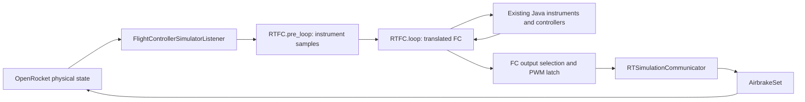

# Zephyrus FC: first implementation in Java

Updated direction, 20 September 2026. **This is the implementation plan to follow first.** It supersedes the JNI-first recommendation in the [earlier integration plan](/Users/mdn/Developer/ActiveControl_MIT_RktTeam/doc/FCsim/cpp-integration-plan.md). The [framework overview](/Users/mdn/Developer/ActiveControl_MIT_RktTeam/doc/FCsim/flight-computer-simulation-framework.md) remains background source analysis. Implementation completed on 20 September 2026. See the [completion report](/Users/mdn/Developer/ActiveControl_MIT_RktTeam/doc/FCsim/java-translation-implementation-report.md) for evidence, differences, telemetry outputs and test coverage.

## 1. Scope and fixed decisions

Translate the flight computer into the **existing** `edu.mit.rocket_team.zephyrus` classes. Keep **`FlightControllerSimulatorListener`** as its OpenRocket entry point and retain the `RTFC.init → pre_loop → loop` lifecycle. Finish with a working root **`:shadowJar`** containing the Java implementation.

Use these authoritative firmware sources:

- [FC/FC.ino][fc]: setup, loop order, flight states, commands, controller inputs, enable flags, and PWM output selection.
- [RT_Firmware_Libs/airbrakes.h][abh] and [airbrakes.cpp][abc]: the airbrake implementation included by the FC's `#include <airbrakes.h>`.
- The sensor, roll, pyro, and type definitions in the same [firmware library directory][libs], where needed by that FC.

**Ignore `AirbrakesControllerListener` entirely for this work.** It is a separate simulation controller. Do not use its algorithms, configuration, or example runs as the FC implementation or reference. Likewise, do not translate the separate `Zephyrus/airbrakes/airbrakes/airbrakes.ino` sketch. The existing `RTAirbrakesController` class stays, but its behavior is brought into agreement with the FC-included library.

JNI remains a later option, implemented through a **separate simulation listener**. Do not add JNI, a backend interface, a native loader, CMake integration, or a replacement simulation framework now. Keep source references and replay data so the later implementation can be compared with this one.

The first implementation includes FC states, sensor processing used by those states/controllers, airbrake control and actuation, logical pyro behavior, and translation of the FC's roll-controller calls. Radio, flash, power, and audiovisual hardware use small deterministic implementations of their existing Java stubs. Detailed transport, electrical, and mechanical models are outside this first milestone.

## 2. File map: extend these classes

In the table, Java paths are relative to [the existing Zephyrus package][java]. All listed production classes already exist; small method additions, data fields, and nested data holders are sufficient.

| Firmware responsibility | Existing Java destination | Required result |
| --- | --- | --- |
| `FC.ino`: globals, setup, loop, states, commands, PWM callback | [FC/RTFC.java][rtfc] | One FC instance with the source's state and execution order |
| `myTypes.h`: `State` | `util/RTRocketState.java` | `GROUND_TESTING`, `PRE_FLIGHT`, `FLIGHT`, `APOGEE`, `MAIN`, `END`, with source IDs |
| `airbrakes.h/.cpp` | [control/airbrakes/RTAirbrakesController.java][jabc], existing state/measurement classes | Faithful controller translation, including plateau feedback |
| `AirbrakesData` | `util/data/RTFudgedAirbrakesData.java` | Input assembled by `RTFC` from its instruments and state |
| `ADXL357` | `instrument/RTAccel.java`, `util/data/RTAccelData.java` | Measured axes, data-ready handling, gravity subtraction, velocity integration |
| `baro` | `instrument/RTBaro.java`, `util/data/RTBaroData.java` | Pressure-derived altitude, 20-sample average, zeroing, maximum altitude |
| `GPS` | `instrument/RTGPS.java`, `util/data/RTGPSData.java` | Fix type, decoded position, relative height and maximum altitude |
| `gyro` | `instrument/RTGyro.java`, `util/data/RTGyroData.java` | Rate signs, integrated attitude, zeroing |
| `pyro` | `control/RTPyroController.java`, `util/data/RTPyroStatus.java` | Six channels, arm/fire/off, duration and continuity status |
| `rollcontrol` | `control/RTRollController.java` | Source computation and commanded angle |
| Hardware-facing calls | Existing `internal`, `telemetry`, `AV`, and `util/hardware` classes | Declared input/status values and recorded side effects |
| OpenRocket input/output | [FlightControllerSimulatorListener.java][listener] and [util/RTSimulationCommunicator.java][comm] | Sampling, FC scheduling, component binding, application of effective outputs |

The resulting path is:



## 3. Translation rules

1. **Match checked-out firmware behavior first.** Preserve constants, comparisons, statement order, casts, and transition side effects. Add source file/function references above each translated block. Do not retain conflicting constants from the old Java airbrake implementation.
2. **Use `float` where the source stores `float`.** Preserve expression evaluation and assignment rounding where practical, including C++ double-valued expressions. Java math functions may require explicit casts. Compare numerically with tolerances; do not claim bit-for-bit embedded equivalence.
3. **Make mutable state belong to one flight.** `RTFC`, instruments, controllers, clock, logs, and component bindings must not share mutable static state between runs. Constants can remain static. A new simulation creates a fresh FC; entering preflight within the same simulation follows only the source's reset actions.
4. **Use simulation time exclusively.** Store monotonic microseconds in a Java `long`; expose Arduino-compatible unsigned 32-bit `millis`/`micros` values and masked elapsed subtraction. Remove wall-clock fallbacks and replace firmware busy-waits with scheduled calls.
5. **Separate translation fixes from firmware changes.** Repair Java injection bounds, missing setup, null handling, wrong units, and obsolete controller logic. Preserve source quirks such as integer-divided airbrake time, the prediction patch, and the zero-area-to-full-deployment rule. Any later correction gets its own documented change and test.
6. **Do not reproduce undefined memory access.** Reject malformed commands and out-of-range pyro channels. Explicitly initialize Java measurement entries to match the firmware globals' initial zero values; a Java array of null measurement objects is not equivalent.

## 4. Implementation checklist

Follow the steps in order. Each step states what to edit and what must pass before moving on. Test names below were planning labels under `core/src/test/java/edu/mit/rocket_team/zephyrus/`; the completion report maps them to the implemented, partly consolidated test classes. In early steps, use simple recording stubs for dependencies completed in later steps; do not wait for a full simulated flight to test a translation.

### Step 1 — Record the translation baseline

**Edit:** add source provenance and a short behavior-difference ledger under `doc/FCsim/`; add replay inputs under `core/src/test/resources/zephyrus/`.

- [x] Record the FC sketch revision `4cd2660eec92a47be42c09ed7b61f38295bcf970` and firmware-library revision `1db1f223c0c7d2287611c9f66d5de6c691455359`, plus file hashes and any local changes at implementation time. Record the then-current OpenRocket revision too.
- [x] Confirm that the translation uses the explicitly named adjacent firmware library, rather than relying on the machine's Arduino include search order.
- [x] Preserve the current root `shadowJar` build result as the packaging baseline.
- [x] Define deterministic replay rows: boot microseconds, sensor values/new-data flags, optional command bytes, and expected observations. Start with stationary-pad, synthetic ascent/coast, and forced state-transition cases.

**Done when:** every translated function can be traced to one selected source file, and replay inputs are saved independently of the Java implementation.

### Step 2 — Repair and retain the existing Java lifecycle

**Edit:** `RTFC`, the FC listener, `RTSimulationCommunicator`, and existing controller/instrument base classes only as required; make the small engine listener-filter change described below for its auxiliary coast calculation.

- [x] Give the listener one `RTFC` and one communicator instance. Convert FC/controller mutable statics to instance fields, passing clock values explicitly to instruments and controllers.
- [x] Keep `init`, `pre_loop`, and `loop`. Add a typed `pre_loop` overload using existing data classes, with a small nested input holder if useful. Avoid storing measured values by modifying a shallow-cloned `SimulationStatus.extraData` map.
- [x] Make `init` perform the source-equivalent setup of instruments, controllers, and peripheral stubs. Remove the current missing-controller-setup failure.
- [x] Remove the incorrect controller-injection loop bounded by the sensor count. `pre_loop` supplies instruments; `RTFC.loop` constructs controller inputs after instrument processing.
- [x] Allow normal startup with no `initialStatus`. Bind components in the simulated rocket copy. An airbrake-only test must work without tab-controlled fins; missing or ambiguous required airbrakes must produce a useful configuration error.
- [x] Preserve public signatures needed by unrelated code if compilation requires it, but do not route the FC through legacy static state or refactor the excluded listener.
- [x] At same-flight status/listener copies, preserve the live FC, clock, and tick counters. A new top-level run gets fresh objects. Rebind copied components when necessary. Initially support one FC-bearing branch; report unsupported staging explicitly.
- [x] Exclude the live FC listener from the engine's auxiliary coast calculation. That calculation must neither reset nor advance the real FC.

**Check:** `RTFCLifecycleTest`: initialize without a special initial status, run with airbrakes and no roll tabs, repeat a run, interleave two independent FC instances, and exercise a same-flight listener copy.

**Done when:** startup and isolation checks pass and both `core` and `swing` still compile.

### Step 3 — Translate the FC-included airbrake library in place

**Edit:** `RTAirbrakesController`, its existing state/measurement classes, and `RTFudgedAirbrakesData`.

- [x] Add source-shaped `update`, `getDeployment`, and `getState` methods. Let `setup` represent `begin`. Keep required `RTController` methods as thin delegates where needed, with one execution path.
- [x] Copy header defaults, including 20 measurements at 5 Hz, mass/density/drag parameters, trial apogee times 34/35/36 s, the 1.5 s offset, start/preparation thresholds, and `SIM_PREDICTED_ALTITUDE=5046`.
- [x] Translate helpers and the entire state handler in source order: `DISABLED → PREP → PREPROCESS → WAIT_FOR_START → CONTROLLING_RAMP → CONTROLLING_PLATEAU → DONE`. Retain the source enum's `INFEASIBLE` value without inventing transitions into it.
- [x] Translate the altitude prediction, dynamic target calculation, area request, `computeK`, integral update, saturation, and anti-windup behavior. Remove the old Java constant-plateau behavior and conflicting fit logic.
- [x] Use boot milliseconds for the library's `millis()` sample spacing. Use the separately supplied flight-time argument for fits and state timing. Preserve the source's `>= 200 ms` sampling comparison.
- [x] Make `setAirbrakesServo` update the controller's requested deployment only. Physical actuation belongs to the FC's gated output path in Step 7.

**Check:** `RTAirbrakesReplayTest`. Compare saved traces from the selected C++ library with Java for nominal coast, late preparation/partial samples, apogee, nonpositive velocity, and area limits. A tiny standalone C++ reference runner is test tooling only; it introduces no JNI or native dependency in OpenRocket. Initialize its controller with the same zero-initialized static storage used by the FC sketch, and supply a fake boot clock. Generate fixtures from that runner and keep ordinary Gradle tests Java-only. Include the FC's integer-time input path as well as fractional-time library-only cases, so these two contracts cannot be confused.

Require identical states, sample counts, and decision times for identical inputs. Start with numerical tolerances `abs(error) <= 1e-5 + 1e-5 * abs(reference)` for finite float outputs; investigate discrepancies before changing tolerances. Test source nonfinite results explicitly rather than treating them as a successful match. In a closed-loop simulation, report a nonfinite actuator result as an error instead of silently inventing a command.

**Done when:** the Java controller matches the selected library on the saved traces and never directly changes an OpenRocket component.

### Step 4 — Complete the existing instrument classes

**Edit:** `RTAccel`, `RTBaro`, `RTGPS`, `RTGyro`, and their existing data classes.

- [x] Translate accelerometer update/data-ready behavior, X-axis gravity subtraction, `PRE_FLIGHT` integration threshold of 10 m/s², integrated velocity, and zeroing. Keep raw-count conversion/calibration as pure helpers if raw samples are supplied; do not apply calibration twice to engineering-unit inputs.
- [x] Translate barometric altitude computation, the 20-entry zero-initialized moving average, offset, maximum, and reset methods. Inject pressure/temperature before altitude processing; do not inject already-filtered truth altitude into the FC path.
- [x] Extend GPS data beyond a boolean fix: preserve fix type, fresh/stale observations, decoded height, height offset, and maximum-altitude updates. Translate the source's `height` semantics and millimeter-to-meter conversion. UBX transport parsing can remain outside the physical sensor adapter.
- [x] Translate gyro integration, degrees-per-second units, negative-X roll sign, attitude zeroing, and angle-from-vertical calculation. Retain raw conversion/bias helpers for raw replay inputs.
- [x] Keep sample acquisition time and availability explicit. No new accelerometer observation means no fabricated data-ready update. A source method called twice at the same firmware time must not accidentally integrate two elapsed intervals.

**Check:** `RTInstrumentProcessingTest`: stationary pad, constant acceleration, stale/new readings, preflight threshold, gyro sign, barometer filter startup and repeated zeroing, GPS fix loss/recovery, and unsigned clock wrap. Assert source formulas and offsets, not equality with perfect simulator velocity/altitude.

**Done when:** `RTFC` can obtain the same measured/estimated quantities used by `FC.ino` without reading OpenRocket truth directly.

### Step 5 — Translate the FC state machine and loop

**Edit:** `RTFC`, `RTRocketState`, and existing peripheral stubs.

- [x] Replace `DISREEF` with the source's `MAIN` state/ID and update relevant Java callers.
- [x] Translate FC fields and `handleState` directly, including timestamps, received state, logging flag, enable flags, converter commands, and the one-shot flags.
- [x] Run each nominal 10 ms FC iteration in this order: barometer, accelerometer, gyro, GPS, pyros, power; set `FCtime`; handle state; update enabled roll controller; update enabled airbrakes; telemetry/logging if elapsed time is `>50 ms`; read commands; send power command if elapsed time is `>100 ms`.
- [x] Preserve the extra `updateAirbrakes` and `updateRollControl` calls inside the transition to `FLIGHT`, followed by the normal enabled-controller calls in that same loop.
- [x] Fill airbrake input with `baro.getFilteredAltitude()`, `accel.getIntegratedVelo()`, `accel.getAccelZ()`, and `currentState.ID > FLIGHT.ID`. Remove true velocity and simulator-apogee injection from this path.
- [x] Preserve `(elapsedFlightMillis / 1000)` integer division before conversion to float for airbrakes. Keep fractional seconds for roll. Fractional airbrake time is a later firmware correction, not part of the first translation.
- [x] Translate the 16-byte uplink validation and FC command effects into an in-memory queue consumed at the source's `readTelem` position. Preserve checksum, byte order, allowed-state checks, and command latency; validate state values and six-channel bounds.
- [x] Record flash/logging, telemetry, power, camera, and video side effects in their existing stubs. Do not emulate SPI, UART electrical timing, flash erase waits, or RF propagation.

**Check:** `RTFCStateMachineTest`, with values just below, exactly at, and just above each boundary:

| Trigger | Expected source behavior |
| --- | --- |
| Received `PRE_FLIGHT` | Enter preflight; zero instruments; close/disable controllers; enable logging/converters |
| Received `FLIGHT` or measured X-minus-gravity `>30 m/s²` | Enter flight; save flight-start time; perform transition controller calls; enable controllers |
| Flight elapsed `>26000 ms` | Apply apogee detection, including the one-time barometer maximum reset |
| Qualified drop `>20 m` or received apogee after lockout | Enter apogee; fire 0/1; close/disable controllers |
| Flight elapsed `>35000 ms` | Force apogee |
| Apogee elapsed `>3000`, then `>5000 ms` | Fire 3/4 once, then 5 once |
| Apogee elapsed `>55000 ms`, with qualifying height `<457 m` or received main | Enter `MAIN`; fire 2; disable roll-servo signal/power |
| Received `END` while in `MAIN` | Return to ground testing; stop logging |

**Done when:** the state sequence, call order, commands, and side effects pass deterministic tests, including a second preflight entry that preserves the source's incomplete in-flight reset behavior.

### Step 6 — Finish logical pyros and roll control

**Edit:** `RTPyroController`, `RTRollController`, and their `RTFC` calls.

- [x] Change the Java pyro model from 12 channels to the source's six. Port arm/fire/off, fire duration, packed status, and continuity handling in source order. Remove its wall-clock fallback.
- [x] Translate `rollcontrol.h/.cpp` into `RTRollController`, including atmosphere, gain calculation, angle limits, and servo effectiveness. Return the requested angle; do not add another control algorithm.
- [x] Keep logical roll computation active when the FC enables it. For the first airbrake test rocket, leave physical roll-tab coupling disabled and label that configuration. Absence of roll tabs must not stop FC/airbrake validation.
- [x] Record pyro events throughout. For this first milestone, use explicitly configured OpenRocket recovery and label pyros **recorded only**. Mapping channels to physical recovery events is a later addition.

**Check:** `RTPyroControllerTest` and `RTRollControllerTest`: armed/unarmed firing, pulse timeout, continuity results, invalid channels, zero/constant roll inputs, velocity bounds, and representative source-derived numerical cases.

**Done when:** these FC calls execute with deterministic logical outputs and require no hardware or optional rocket components.

### Step 7 — Apply the FC's effective airbrake output

**Edit:** `RTFC` output methods and `RTSimulationCommunicator`.

- [x] Translate `dpToDeg`, `degToUsAirbrakes`, and the airbrake portion of `Update_IT_callback`. Keep closed/open angles at −67°/−117°, the source pulse conversion, and integer pulse-width truncation.
- [x] Select automatic deployment when `airbrakesEnabled` is true; otherwise select the source's manual/closed `airbrakesSetAngle`. An FC apogee transition therefore closes the effective output even if the airbrake controller stops receiving updates.
- [x] Latch PWM every 20 ms. Log requested deployment, selected angle, pulse width, and realized exposed fraction separately.
- [x] Start with ideal motion after the PWM latch. Derive exposed fraction from the latched pulse/angle using the declared linear closed-to-open mapping; clamp only at the physical component boundary. Record this as an assumed linkage model, not a calibrated mechanism.
- [x] Apply that fraction through the existing communicator and `AirbrakeSet.setFracExposed`. Use the existing component aerodynamics; do not add another drag multiplier in the FC adapter.

**Check:** `RTFCOutputTest`: enabled automatic command, ground manual angle, preflight closure, apogee closure, pulse rounding, and 20 ms hold behavior. Also check that increasing exposed fraction increases modeled airbrake drag in a fixed flight condition.

**Done when:** the physical component follows the FC's effective output, including its enable and manual-command rules.

### Step 8 — Connect coherent simulated sensor inputs

**Edit:** the existing FC listener's sampling/fudging methods and data injection.

| Input | First implementation contract |
| --- | --- |
| Accelerometer | Sensor-axis specific force in m/s²: rotate world `(acceleration − gravity vector)` into body coordinates using the attitude quaternion, then into sensor coordinates |
| Barometer | Convert atmospheric Pa to hPa and K to °C before the translated altitude/filter methods; raw ADC fields are unavailable in this mode, not mislabeled physical values |
| GPS | Latitude/longitude in degrees, decoded absolute height and fix type; source zeroing supplies relative height. Document the simulator-height/GPS-datum approximation |
| Gyro | Rotate angular velocity into sensor axes and convert rad/s to degrees/s before source integration/sign handling |
| Noise | Off for the first acceptance run; any later noise uses a per-run recorded seed |

- [x] Replace the current horizontal-acceleration-magnitude duplication and orientation-angle shortcuts. Capture an actual vector and matching attitude/time; fix the GPS radians/degrees error.
- [x] Use an explicit mounting rotation. Until hardware orientation is confirmed, the declared simulation default is sensor X = body Z, sensor Y = body X, sensor Z = body Y. Treat this as an assumption, not a board measurement. Preserve the FC's separate use of sensor X for velocity and sensor Z for airbrake acceleration; do not alias them.
- [x] Capture the first acceleration evaluation at an accepted physics-interval start, together with position, atmosphere, attitude, and sample time. Use the existing acceleration callback, restricted to that first evaluation. Publish the sample only after the interval completes; discard intermediate RK trial evaluations.
- [x] Deliver the latest coherent sample at the next FC tick. This intentionally models up to one physics-step acquisition latency. Record acquisition and delivery times; do not combine a start-of-step acceleration with an end-of-step attitude or label it an endpoint measurement.

**Check:** `RTFCSensorAdapterTest`: upright stationary pad, free fall, upward thrust, tilted orientation, positive rotation, launch-site coordinates, and pressure/temperature units. Check the callback capture against both RK steppers. Simulator truth may be logged for comparison, but is not a controller input shortcut.

**Done when:** those fixtures prove units, signs, time coherence, and the assumed mounting. Confirm real board mounting before claiming physical sensor fidelity.

### Step 9 — Make FC timing independent of physics steps

**Edit:** the FC listener, [ModifiedEventSimulationEngine][engine], and the existing [RK6][rk6]/[RK4][rk4] step-limit handling where necessary. Keep scheduling counters with the run's existing FC/listener state; do not introduce another scheduler framework.

- [x] Run one FC iteration per 10,000 boot microseconds and one PWM latch per 20,000 microseconds. At a shared deadline: deliver samples, run FC, latch PWM, then hold the output for the next physics interval.
- [x] Start with a maximum physics step of 2.5 ms. In FC mode, bound each step by numerical limits, the next engine event, FC tick, and PWM deadline. Correct the existing hardcoded step override and minimum-step enlargement so neither can step across these deadlines. Cover landing/ground steppers too.
- [x] Guard unchanged-time `postStep` calls and terminal `step(..., NaN)` recording calls. Never run the controller inside RK trial evaluations, or replay several missed ticks using one future sample. If a deadline is skipped, fail the timing test rather than hiding the error.
- [x] Before OpenRocket time zero, run a stationary-pad warmup for 1,000 ms of firmware time. Queue the simulated `PRE_FLIGHT` command at boot 500 ms, after the barometer has filled its first window; consume it at the normal command-read point. Release the physical flight at boot 1,000 ms. The FC detects `FLIGHT` itself. Treat peripheral setup delays as an explicit nominal abstraction, with no real sleeps.
- [x] Preserve normal simulations' behavior when this FC listener is absent. Do not use global step changes that affect another concurrent simulation.

**Check:** `RTFCTimingTest`: compare runs with maximum physics steps of 2.5 ms and 1 ms. FC/PWM tick schedules must agree exactly; compare trajectories with a declared integration tolerance. Exercise an engine event at an off-grid time, repeated callbacks, same-flight copies, and a transition to a landing stepper.

**Done when:** firmware/PWM cadence and execution count are deterministic, including around engine events, without changing ordinary non-FC timing.

### Step 10 — Run the complete Java implementation and package it

**Edit:** add a small FC-specific `.ork` fixture and a test using the existing `Simulation.simulate(...)` entry point. Add concise run instructions and a result log.

- [x] Use a single-stage rocket with one `AirbrakeSet`, explicitly configured recovery, and physical roll coupling off. Register `FlightControllerSimulatorListener` directly in the test. For a GUI example, use the existing Java-code extension with that listener's full class name.
- [x] Run from stationary preflight through ascent, braking, and FC apogee closure. Choose a fixture long enough to exercise controller preparation and deployment. Compare with an otherwise identical run whose physical airbrake output is held closed.
- [x] Record boot/flight time, acquisition/delivery time, measured and estimated state, FC/controller states, commands, PWM, realized deployment, and all six pyro events. Use streamed logs. Per the subsequent user request, print all actions, including physics steps, with `System.out.println`.
- [x] Confirm the closed-loop trajectory responds to airbrake drag. Do not require a tuned target altitude as proof of a faithful translation: the source's fixed prediction and other quirks remain in this baseline.
- [x] Run repeat/interleaved simulations and the relevant existing engine/event tests. Test descent timers by replay even if the chosen physical flight lands before the source's long `MAIN` lockout expires.
- [x] Build and launch the root shadow JAR. Verify the listener is actually registered and runs from the packaged artifact, rather than merely checking that its class exists.

**Done when:** the FC-specific end-to-end test, source-comparison checks, existing simulation regressions, and packaged-JAR smoke test pass. No native FC library is required.

## 5. Commands and completion criteria

Run from [the OpenRocket root][or]. Add `--offline` only when dependencies are cached. These commands are for implementation validation; tests named in this plan must be added first.

```sh
./gradlew :core:compileJava :swing:compileJava
./gradlew :core:test --tests 'edu.mit.rocket_team.zephyrus.*'
./gradlew :core:test --tests 'info.openrocket.core.simulation.FlightEventsTest' --tests 'info.openrocket.core.simulation.SimulationConditionsTest'
./gradlew shadowJar
```

The first implementation is complete when a packaged OpenRocket run uses the existing FC listener and translated Java classes, obtains controller inputs through the translated instruments, respects the FC's state/command/timing rules, and changes airbrake exposure through the existing communicator. Source differences, sensor mounting assumptions, ideal actuator behavior, recorded-only pyros, and disabled physical roll coupling must be visible in the run notes.

After that milestone, evaluate separately: firmware-behavior corrections, measured sensor/linkage calibration, finite actuator motion, physical roll/recovery coupling, and JNI via its own listener. The saved replay inputs and outputs provide the common comparison basis; they do not require a backend abstraction now.

[or]: /Users/mdn/Developer/ActiveControl_MIT_RktTeam/clone/openrocket/
[java]: /Users/mdn/Developer/ActiveControl_MIT_RktTeam/clone/openrocket/core/src/main/java/edu/mit/rocket_team/zephyrus/
[fc]: /Users/mdn/Developer/MIT_Rkt_Team/Avionics2025/RT_Arduino/Zephyrus/FC/FC.ino
[libs]: /Users/mdn/Developer/MIT_Rkt_Team/Avionics2025/RT_Firmware_Libs/
[abh]: /Users/mdn/Developer/MIT_Rkt_Team/Avionics2025/RT_Firmware_Libs/airbrakes.h
[abc]: /Users/mdn/Developer/MIT_Rkt_Team/Avionics2025/RT_Firmware_Libs/airbrakes.cpp
[rtfc]: /Users/mdn/Developer/ActiveControl_MIT_RktTeam/clone/openrocket/core/src/main/java/edu/mit/rocket_team/zephyrus/FC/RTFC.java
[jabc]: /Users/mdn/Developer/ActiveControl_MIT_RktTeam/clone/openrocket/core/src/main/java/edu/mit/rocket_team/zephyrus/control/airbrakes/RTAirbrakesController.java
[listener]: /Users/mdn/Developer/ActiveControl_MIT_RktTeam/clone/openrocket/core/src/main/java/info/openrocket/core/simulation/listeners/FlightControllerSimulatorListener.java
[comm]: /Users/mdn/Developer/ActiveControl_MIT_RktTeam/clone/openrocket/core/src/main/java/edu/mit/rocket_team/zephyrus/util/RTSimulationCommunicator.java
[engine]: /Users/mdn/Developer/ActiveControl_MIT_RktTeam/clone/openrocket/core/src/main/java/info/openrocket/core/simulation/ModifiedEventSimulationEngine.java
[rk6]: /Users/mdn/Developer/ActiveControl_MIT_RktTeam/clone/openrocket/core/src/main/java/info/openrocket/core/simulation/RK6SimulationStepper.java
[rk4]: /Users/mdn/Developer/ActiveControl_MIT_RktTeam/clone/openrocket/core/src/main/java/info/openrocket/core/simulation/RK4SimulationStepper.java
