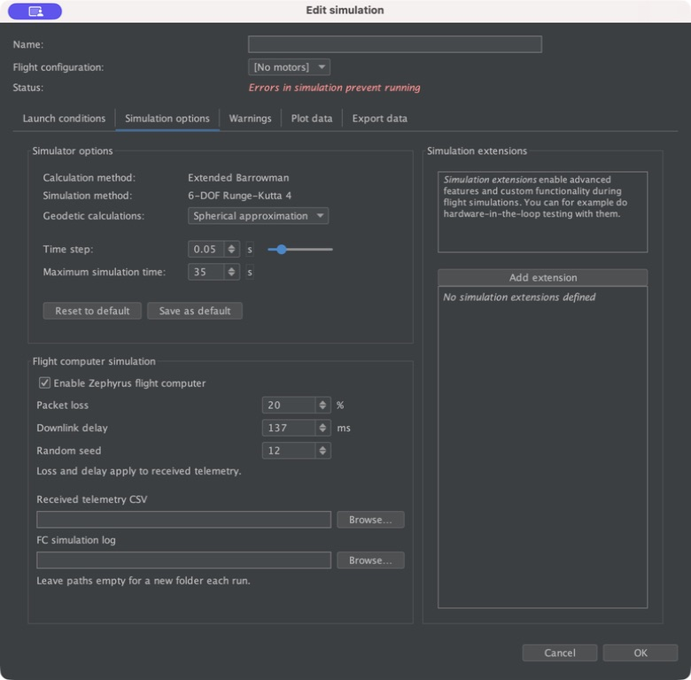
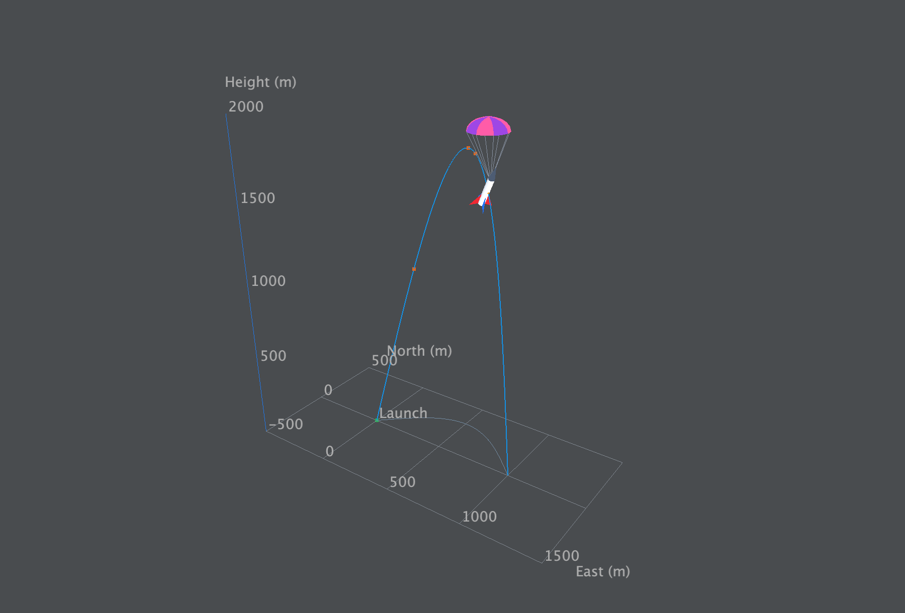

# OpenRocket MIT 6.2: implementation and verification

Implemented 20 September 2026 in `clone/openrocket-release-24.12.RC.01` (also accessible through `clone/openrocket`). The existing Java FC listener and Swing plotting framework are extended. The separate `AirbrakesControllerListener` and deferred hardware-timing corrections are outside this change.

## What is available

**Flight computer simulation** now sits **below Simulator options in the left column** of Edit simulation → Simulation options, with 12 logical pixels between the panels. The right column keeps the ordinary extension controls.

The box provides enable/disable, packet-loss percentage, fixed downlink delay, repeatable random seed, and independent **Browse…** selectors for received CSV and FC action-log paths. Disabling the FC retains settings. Existing generic Java-code FC extensions are recognized; changing their settings converts only those entries to the managed extension. Unrelated extensions are preserved. Duplicate FC listeners are rejected before a run starts.

The normal `.ork` extension configuration saves these settings. Clone/cancel restores configuration; changing FC settings marks old results outdated without throwing away the data. Multi-edit clones settings rather than sharing mutable extension objects.

**Plot data → Plot type → 3D trajectory → Plot** opens the trajectory viewer. It uses available results directly, including outdated results, without triggering a simulation to obtain missing attitude. Ordinary 2D graphs remain the default.

The viewer includes:

- Equal spatial scaling for East, North, and Height, launch marker, ground grid, ground projection, and branch-specific event markers.
- Drag to rotate, Shift-drag or middle/right-drag to pan, wheel to zoom, camera presets, Fit/Reset, and optional follow-position.
- Paused initial state, Play/Pause, Restart, timeline seeking, event seeking, and editable 0.01×–20× playback speed (default 0.25×).
- A rocket cartoon with four fins alternating red/blue and a roll stripe, driven by the recorded body-to-world quaternion. Its nose is body +Z; its orientation is independent of velocity and camera direction.
- Bright yellow exhaust along body −Z during the recorded motor burn, from launch ignition until burnout. It follows the true attitude and cartoon size, disappears exactly at burnout, and returns when seeking backward. Delayed ignitions, coasting gaps, and overlapping motor burns use their recorded events.
- A separately scaled velocity arrow from actual world velocity components and a true-speed readout. Slow playback does not change the displayed physical speed.
- A symbolic canopy with alternating pink/purple panels after actual OpenRocket recovery deployment. Seeking backward removes it. Logical FC pyro commands alone do not create it.
- PNG export and explicit fallback when native OpenGL is unavailable.

The normal data writer now records quaternion W/X/Y/Z and horizontal velocity X/Y alongside existing time, position, and vertical velocity. No physics step sizes or FC periods are changed for animation. Samples survive `.ork` serialization.

## Choosing output files

Leave both paths blank to create a unique `zephyrus-*` directory for each run under the configured telemetry parent. The defaults are:

| File | Contents |
| --- | --- |
| `telemetry.csv` | Received ground-station-compatible 43-column CSV |
| `packets.bin` | Received 128-byte payloads in matching row order |
| `transmitted-telemetry.csv` | All generated packets before link loss/delay |
| `transmitted-packets.bin` | All generated payloads |
| `metadata.txt` | Settings, absolute paths, counts, completion, and timestamp definitions |
| `OR.log` | FC action lines also printed with `System.out.println` |

For a selected `/folder/flight.csv`, the companions are `flight-packets.bin`, `flight-transmitted.csv`, `flight-transmitted-packets.bin`, and `flight-metadata.txt` in that folder. The default log then becomes `flight.log`. Choosing a separate log path overrides that default and may use another folder.

Parent directories are created as needed. **Existing files are preserved**: a reused output name produces an actionable simulation error instead of overwriting the earlier run. Choose fresh names for another run or clear the fields to return to automatic directories. For multiple simulations, keep automatic output or choose distinct paths per simulation before running the batch; copying a fixed filename to every simulation does not make it unique.

The completion dialog and console provide both CSV and log paths. `OR.log` contains the FC action trace, including setup and shutdown; use shell redirection/`tee` as before when you also want unrelated application diagnostics.

Packet loss is an independent Bernoulli decision for each generated packet. Fixed delay changes receiver arrival timestamps, not the packet's firmware time or checksum. The FC clock never sleeps or advances to deliver a packet. Normal completion drains pending arrivals without running more FC iterations; cancellation/failure records incomplete output and pending counts.

## Build and installed-app compatibility

Build the root `shadowJar` using JDK 17. The MIT artifact is:

`clone/openrocket/build/libs/OpenRocket-MIT-6.2.jar`

Both the MIT build property and JAR implementation version are 6.2. The upstream base remains 24.12.RC.01; the ORK format version is unchanged.

The installed `/Applications/OpenRocket_MIT.app` uses a symlink from its internal `OpenRocket-24.12.jar` to `build/libs/OpenRocket-24.12.RC.01.jar`. Renaming the shadow artifact initially exposed the root project's 423-byte thin JAR at that path, causing `ClassNotFoundException: info.openrocket.swing.startup.OpenRocket`.

That regression is repaired. The thin root artifact now ends in `-plain.jar`. After `shadowJar`, the `launcherJar` task validates the startup class and atomically publishes a full compatibility copy at the existing installed-app path. The versioned artifact, compatibility copy, and installed symlink target have identical hashes. Running the ordinary `jar` task was also checked to ensure it cannot replace the launchable artifact. The installed app was observed opening successfully after repair. An already-running instance needs a restart to load the final package; unsaved user documents were left alone.

The renderer check also found a pre-existing dependency omission: GlueGen's Java runtime had been packaged without its native library. The shadow artifact now includes matching 2.5.0 native runtimes for macOS universal, Windows x64, Linux x64 and Linux ARM64. The small unmodified macOS dependency and upstream license are in `swing/lib/`; provenance is documented there because the JogAmp server was unreachable during the build. The license is also included in the delivered JAR.

## Verification results

| Check | Result |
| --- | --- |
| FC-focused core suite | 32 tests passed |
| Trajectory adapter/playback suite | 7 tests passed |
| Root shadow build and launcher compatibility task | Passed |
| Root thin-JAR task preserves installed launcher | Passed |
| Startup class, native libraries, MIT version and matching installed-target hash | Verified in packaged JAR |
| Packaged 35-second synthetic run, 20% loss, 137 ms delay, seed 12 | 600 transmitted; 472 received; 128 dropped; 0 pending |
| Packaged synthetic run, 100% loss | 600 transmitted; empty received binary and header-only CSV |
| Independent telemetry decoder | Both receiver cases passed schema, byte/checksum, subsequence, timing and count checks |
| Actual 100,000-sample GL panel | About 68.9 frame requests/s; mean draw 1.97 ms; adapter construction 82.5 ms |
| UI observation | Left-column placement and CSV save chooser confirmed; installed application startup confirmed |

The physical-flight comparison test uses clones of the same rocket/configuration. Nonzero loss/delay leaves FC tick sequences, generated packet bytes, and maximum altitude unchanged. Other core tests cover loss extremes, seeded reproducibility, non-tick-aligned arrivals, pending packet completion/cancellation, custom file paths, log setup/close, collision protection, settings cloning, legacy normalization, configuration validation, saved-channel round trips and duplicate listeners.

Trajectory tests cover roll independent of velocity, quaternion sign equivalence and near-180° interpolation, missing/duplicate/backward timestamps, unresolved fast rotation, recovery seeking, actual stage-branch copying and event isolation, a monotonic injected playback clock, exact ignition/burnout boundaries, backward seeking through motor burns, and overlapping/delayed motor events. The native render probe exercises the actual `Trajectory3DPanel`, framebuffer export, and resource disposal; it is not a mock renderer.

Performance was measured on an **Apple M3 Max, 128 GiB RAM, macOS 26.5, JDK 17.0.11**, with an 1800×1220 framebuffer, a fixed perspective camera, 20 warmup updates and 200 measured updates. This is an uncapped renderer probe; ordinary playback requests updates at roughly 30 Hz. Camera-drag throughput and other hardware are not covered by that number.

The same native renderer was captured during powered flight ([yellow exhaust at 10 s](verification/trajectory-exhaust.png)), exactly at burnout ([no exhaust at 20 s](verification/trajectory-burnout.png)), and under recovery at 65 s. The exhaust-only update rebuilt `shadowJar`, passed all seven trajectory tests, and rechecked the installed launcher target; earlier FC validation remains recorded above.

Evidence is under [verification](verification/): build/test logs, independent decoder results, receiver/transmitter samples, renderer source/log/PNG, and `verification.json` with the final artifact hash. A complete synthetic run with all FC action logs is retained at:

`sim/FCsim/output/improvements-6.2/link-20pct/`

The synthetic rocket is an implementation fixture, not a launch prediction. Its artificial motor is deliberately absent from the ordinary GUI motor database; reopening its saved results gives a motor warning but does not prevent direct 3D viewing.

## Remaining qualification boundaries

- Older saved results lack full roll attitude. They show the track and a moving position marker; rerun to obtain the cartoon's full orientation. A velocity direction is not invented if components are unavailable.
- OpenRocket's recovery/tumble stepper holds attitude. The viewer reports this and faithfully displays the recorded orientation; it does not add a new descent-attitude model.
- Intervals that cannot resolve rapid rotation are identified instead of synthesizing extra turns.
- The complete manual drag/pan/play/seek/PNG chooser sweep and Windows GUI/installer smoke test remain unverified. Native rendering/PNG export and playback/event mathematics were checked independently. The macOS UI automation service was unreliable during the broader interaction sweep.
- Fixed custom output names are per-run names, not filename templates. Use automatic output for repeated/batch runs or assign distinct names.
- No earlier hardware-time-contract issue is claimed fixed. RF propagation, interrupt execution cost, and the deferred power-command timer discrepancy remain separate work.
